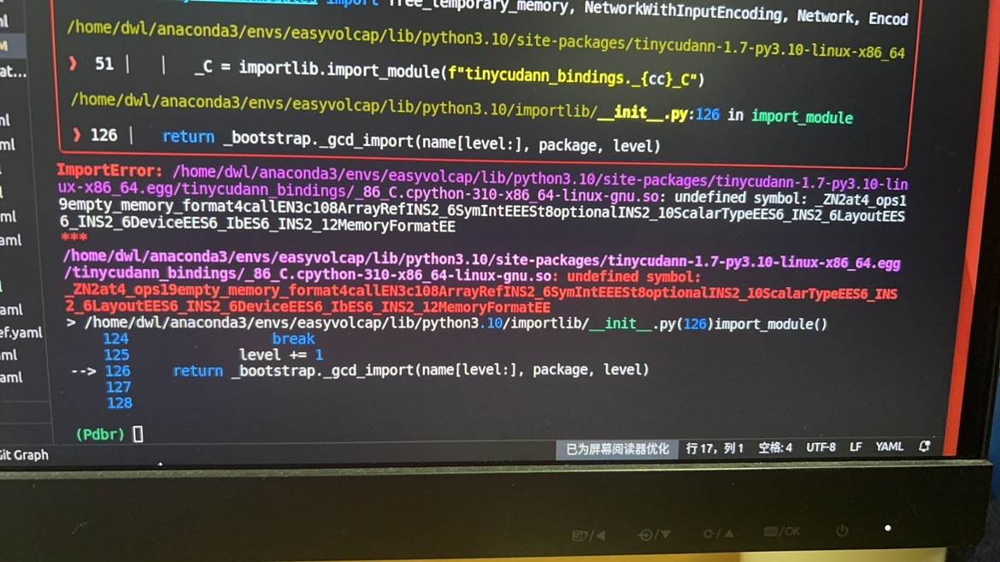
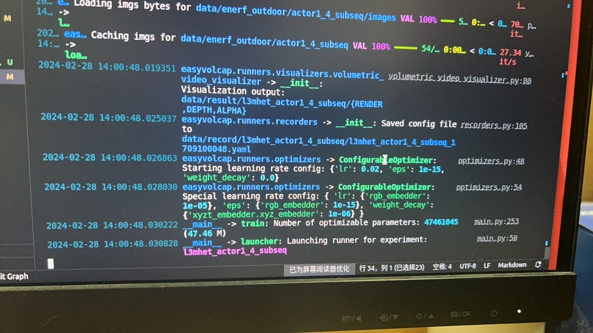

## install
`mamba create -n easyvolcap "python>=3.10" -y`只能安装3.10，否则mediapipe等很多包安装失败，改为`mamba create -n easyvolcap "python==3.10" -y`，不能直接安装3.10环境可能是conda的channels有问题

`pip install git+https://github.com/facebookresearch/pytorch3d`会使键鼠失灵电脑卡死，编译源码安装也会卡死：
```
git clone https://github.com/facebookresearch/pytorch3d.git
cd pytorch3d && pip install -e .
```
通过指令：
```
import sys
import torch
pyt_version_str=torch.__version__.split("+")[0].replace(".", "")
version_str="".join([
    f"py3{sys.version_info.minor}_cu",
    torch.version.cuda.replace(".",""),
    f"_pyt{pyt_version_str}"
])

print(version_str)
```
得到自己的版本信息，例如 py310_cu121_pyt221 ，然后在 https://anaconda.org/pytorch3d/pytorch3d/files 里下载对应的tar.bz2，最后 conda install,但是不存在这个版本的匹配，下载linux-64_pytorch3d-0.7.5-py310_cu121_pyt210.tar.bz2在训练模型时又会卡死。于是将降低pytorch版本`mamba install pytorch==2.1.0 torchvision==0.16.0 torchaudio==2.1.0 pytorch-cuda=12.1 -c pytorch -c nvidia`，再`conda install linux-64_pytorch3d-0.7.5-py310_cu121_pyt210.tar.bz2`，tiny-cuda-nn也要重新编译

mamba遇到类似`ERROR transaction.cpp:84 File not valid: file size doesn't match expectation "/home/dwl/anaconda3/pkgs/p11-kit-0.23.21-hc5aa10d_4.tar.bz2"`的报错一般是conda源有问题，用conda安装的话就一直卡在`Solving environment: | failed with initial frozen solve. Retrying with flexible solve.`

mamba/conda安装时报错`CondaVerificationError: The package for pytorch3d located at /home/dwl/anaconda3/pkgs/linux-64_pytorch3d-0.7.5-py310_cu121_pyt210 appears to be corrupted. The path 'lib/python3.10/site-packages/pytorch3d/vis/texture_vis.py' specified in the package manifest cannot be found.`是pytorch3d包损坏了，先`rm -r /home/dwl/anaconda3/pkgs/linux-64_pytorch3d-0.7.5-py310_cu121_pyt210`再重新安装

pip安装torch、simple-knn、diff-gaussian-rasterization报错`OSError: CUDA_HOME environment variable is not set. Please set it to your CUDA install root.`参考 https://blog.csdn.net/takedachia/article/details/130375718 安装cuda和cudnn

`pip install git+https://github.com/NVlabs/tiny-cuda-nn/#subdirectory=bindings/torch`报错ERROR: Could not build wheels for tinycudann, which is required to install pyproject.toml-based projects，解决：
```
git clone https://github.com/NVlabs/tiny-cuda-nn --recursive
cd tiny-cuda-nn/bindings/torch
python setup.py install
```
测试是否安装成功
```
import commentjson as json
import tinycudann as tcnn
import torch
```
## usage
### Running Instant-NGP+T
更改pytorch版本后要重新编译tiny-cuda-nn

卡死在这里，把configs/exps/l3mhet/l3mhet_actor1_4_subseq.yaml的dataloader_cfg.num_workers改小

爆显存把dataloader_cfg.batch_sampler_cfg.batch_size改小
### Running 3DGS+T
```
// 终端输入
for file in ${source_folder}/*.ply; do
    number=$(echo $(basename ${file}) | sed -e 's/frame\([0-9]*\).ply/\1/')
    formatted_number=$(printf "%06d" ${number})
    destination_file="${destination_folder}/${formatted_number}.ply"
    cp ${file} ${destination_file}
done
// 输出
bash: printf: 0008: invalid octal number
bash: printf: 0009: invalid octal number
bash: printf: 0018: invalid octal number
bash: printf: 0019: invalid octal number
bash: printf: 0028: invalid octal number
bash: printf: 0029: invalid octal number

// 这些错误是由printf命令中的格式字符串导致的。在Bash中，以零开头的数字被视为八进制数，因此如果格式字符串中包含%06d，它将尝试将数字格式化为八进制，并且如果数字中包含8或9，就会报告“invalid octal number”错误。正则表达式去除前导0改为
for file in ${source_folder}/*.ply; do
    number=$(echo $(basename ${file}) | sed -e 's/frame0*\([0-9]*\).ply/\1/')
    formatted_number=$(printf "%06d" ${number})
    destination_file="${destination_folder}/${formatted_number}.ply"
    cp ${file} ${destination_file}
done
```

报错
```
ImportError: /home/dwl/anaconda3/envs/easyvolcap/lib/python3.10/site-packages/simple_knn/_C.cpython-310-x86_64-linux-gnu.so: undefined symbol: _ZNK3c1017SymbolicShapeMeta18init_is_contiguousEv
*** /home/dwl/anaconda3/envs/easyvolcap/lib/python3.10/site-packages/simple_knn/_C.cpython-310-x86_64-linux-gnu.so: undefined symbol: 
_ZNK3c1017SymbolicShapeMeta18init_is_contiguousEv
```
pytorch降版本要重新编译simple-knn，之后diff_gauss(diff-gaussian-rasterization)也会报类似的错要重新编译
```
pip uninstall simple-knn
pip install git+https://gitlab.inria.fr/bkerbl/simple-knn
```